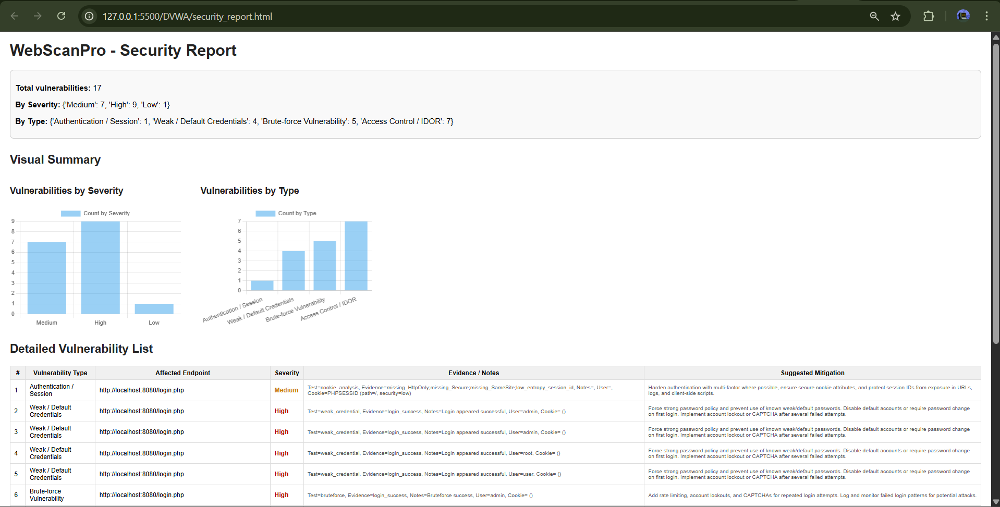
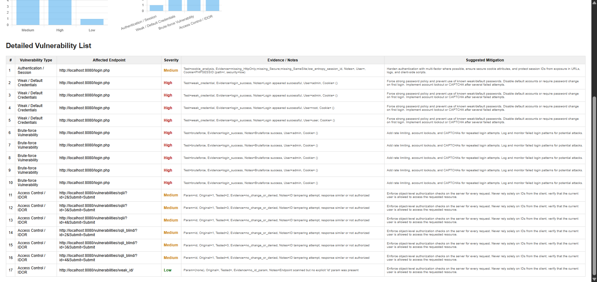

# 🛡️ WebScan Pro
### Automated Web Application Security Testing Tool

WebScan Pro is an intelligent security-testing tool designed to automatically detect vulnerabilities in web applications. It simulates real-world attack vectors, scans targets for weaknesses, and generates detailed security reports with recommended fixes.

## 📌 Project Overview
The goal of WebScan Pro is to perform automated penetration testing on web applications by detecting common vulnerabilities such as:
- SQL Injection
- Cross-Site Scripting (XSS)
- Broken Authentication
- Insecure Direct Object References (IDOR)
- Access control flaws
- Session issues

## 🖼️ Screenshots

### **Dashboard of Severity and Its Types**

### **Detailed Vulnerability List**

## 🔄 Project Workflow

### Milestone 1
**Week 1 — Project Initialization & Setup**
- Define project goals
- Set up DVWA, Juice Shop, or bWAPP
- Explore application structure

**Week 2 — Target Scanning Module**
- Build crawler to detect links & input fields
- Use BeautifulSoup/Selenium
- Store metadata for testing

### Milestone 2
**Week 3 — SQL Injection Module**
- Inject SQL payloads
- Analyze responses
- Recommend fixes

**Week 4 — XSS Module**
- Inject JS payloads
- Detect stored/reflected XSS
- Provide mitigation tips

### Milestone 3
**Week 5 — Authentication & Session Testing**
- Test weak credentials & insecure cookies
- Simulate brute-force and session hijacking

**Week 6 — Access Control & IDOR Testing**
- Attempt privilege escalation
- Test unauthorized object access

### Milestone 4
**Week 7 — Report Generation**
- Compile vulnerabilities
- Add severity, mitigation, endpoints
- Export PDF/HTML

**Week 8 — Documentation & Presentation**
- Finalize documentation
- Prepare slides & demo

## 🎯 Outcomes
- Understanding OWASP vulnerabilities  
- Automated + manual penetration testing  
- Comprehensive reporting  
- Documentation & presentation experience  

## 📘 Tools Used
- DVWA
